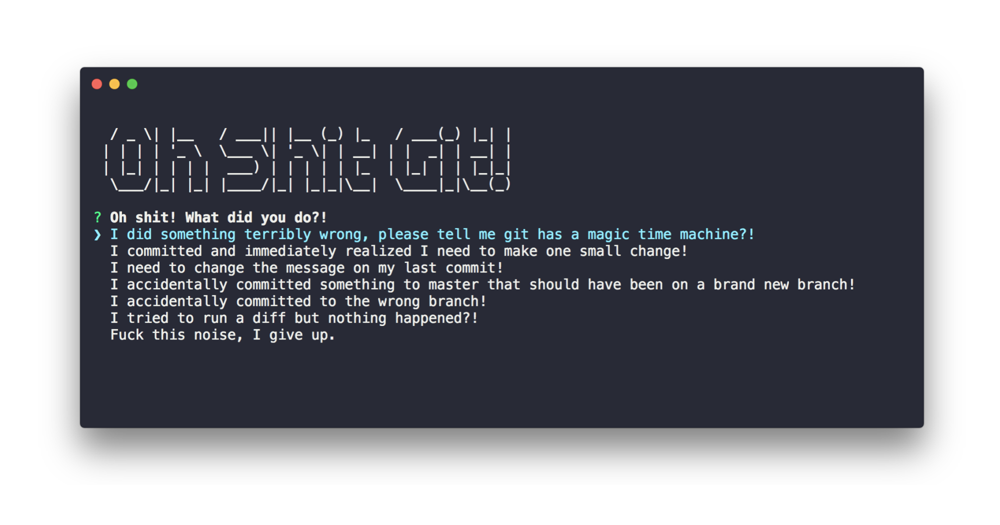

> A cli tool to help you unfuck your git mistake.

Git is hard: screwing up is easy, and figuring out how to fix your mistakes is fucking impossible.

## Innstall

```bash
npm install -g ohshitgit
```

## Usage

Once that's done, you can run this command inside your project's root directory:

```bash
ohshit
```

That's it! :tada:

## Inspired by

## Author

Leif Riksheim ([@leifriksheim](https://github.com/leifriksheim)) - [WTFoo](https://github.com/whatthefoo)
